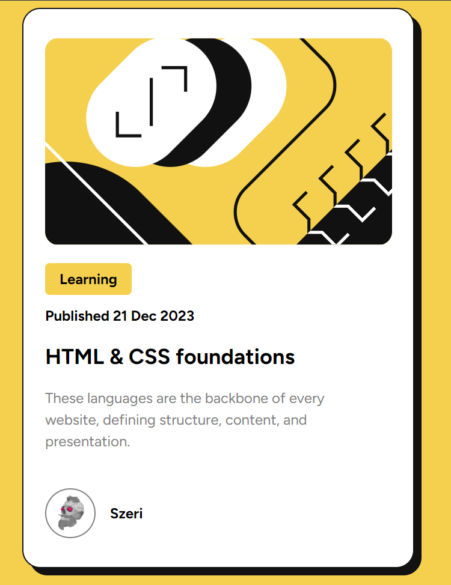
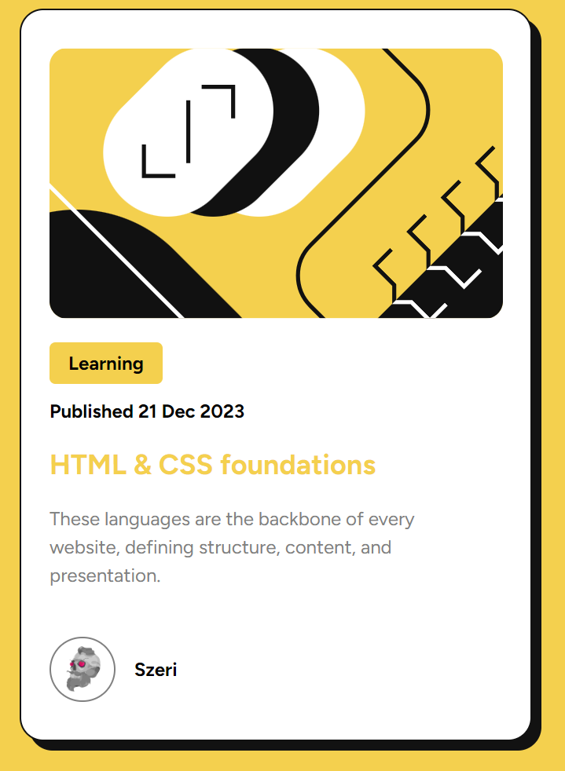
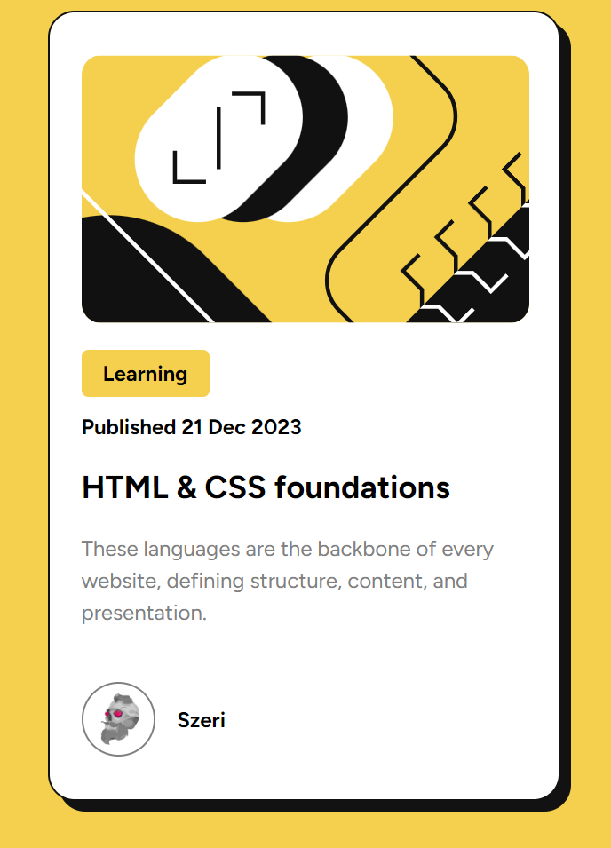

# Introduction

Hello friend, I am practicing frontend skills to faithfully reproduce the design of the project and master the design concepts to build my own interesting designs and variations. If you have any advices for me, please let me know.

# Frontend Mentor - Blog preview card solution

This is a solution to the [Blog preview card challenge on Frontend Mentor](https://www.frontendmentor.io/challenges/blog-preview-card-ckPaj01IcS). Frontend Mentor challenges help you improve your coding skills by building realistic projects. 

## Table of contents
- [Introduction](#introduction)
- [Overview](#overview)
  - [The challenge](#the-challenge)
  - [Screenshot](#screenshot)
  - [Links](#links)
- [My process](#my-process)
  - [Built with](#built-with)
  - [Continued development](#continued-development)
  - [Useful resources](#useful-resources)
- [Author](#author)

## Overview

### The challenge

Users should be able to:

- See hover and focus states for all interactive elements on the page

### Screenshot

### Links

- Live Site URL: [Checkout on centerdiv.pl](https://centerdiv.pl/projects/others/frontendmentor/BlogPreviewCard/blog-preview-card.html)
- Solution URL: [Checkout on frontendmentor.pl](https://www.frontendmentor.io/solutions/html-bem-css-custom-propertiesandpseudoclasses-flexbox-mobilefirst-Jg8X1VSPiw)

## My process

### Built with

- HTML5 
- BEM metodology
- CSS custom properties
- CSS pseudo-classes
- Flexbox
- Mobile-first workflow

### Continued development

I need to practice mainly design skills like matching colors and elements flow.

### Useful resources

- [MDN - media queries](https://developer.mozilla.org/en-US/docs/Web/CSS/CSS_media_queries/Using_media_queries) - It explains well how media queries work

## Author

- Website - [Szeri](https://www.centerdiv.pl)
- Frontend Mentor - [@Szeri](https://www.frontendmentor.io/profile/Szeri323)

